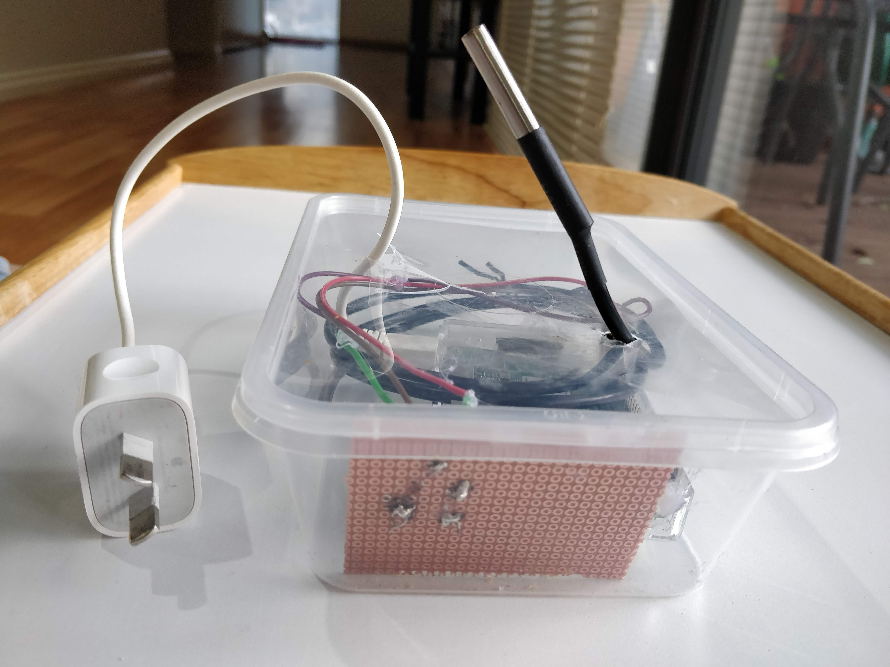
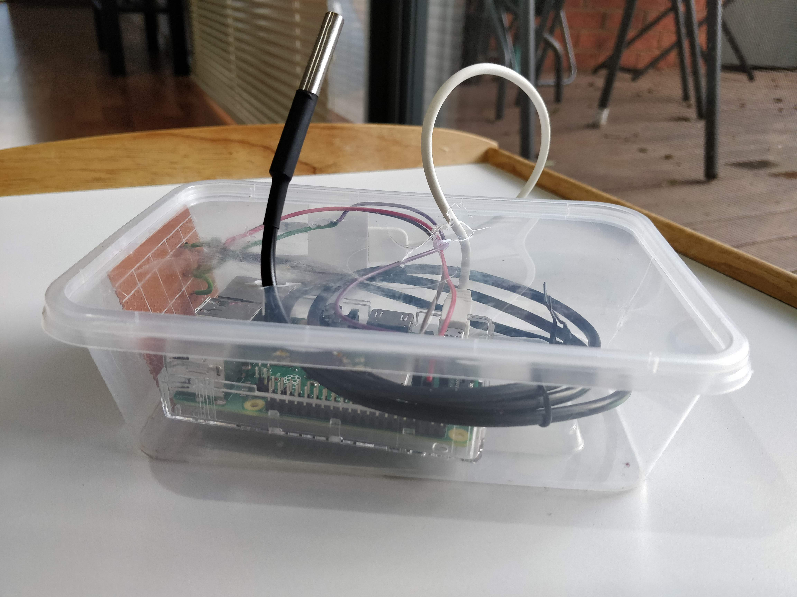
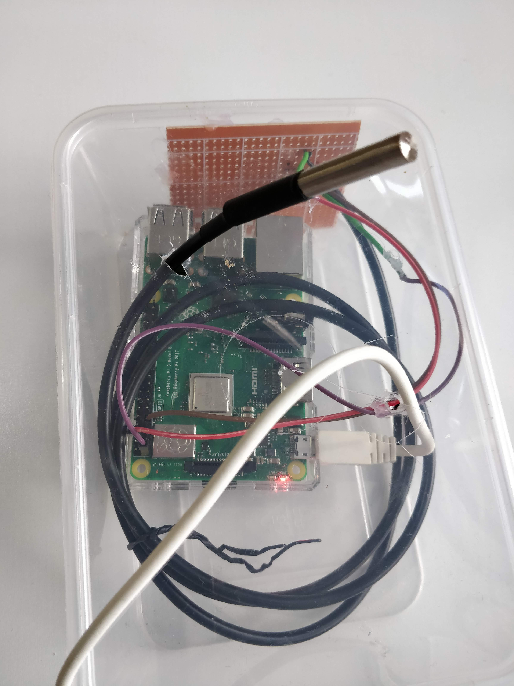

# TempTrends
Capturing the temperature using a DS18B20 temperature sensor and Raspberry PI. This project started out with the need to capture the temperature around the house to look for cold and warm spots. I built this with help from CircuitBasics and extended on it. 

### How does it work?
I used a simple Raspberry PI 3 kit and a DS18B20 water-proof temperature sensor. I've written two python scripts to read the data off the temperature sensor and perform a task. 
I've also used a Time-series DB and a Data visualisation tool to capture the data and visualise it to help make some sense.

### Lets dig deeper
##### sense-standalone.py
This python script helps to capture the temperature and display it on the screen. Use this to write to a log file using the following command:

```bash
$ mkdir -p $HOME/temptrends && mkdir -p $HOME/temptrends/logs && export LOGS=$HOME/temptrends/logs;
$ python3 sense-standalone.sh > $LOGS/sensor$$.log &
```
Note: If using an SD card, your space might fill up quick. You might want to have a log rotation logic in there.

##### sense-trends.py
This python script helps to capture the temperature and upload it to a time-series db i.e InfluxDB on an AWS EC2 box. I have a Grafana server running that can be accessed to visualise the temperature data.

```bash
python3 sense-trends.sh &
```
Note: Ensure the host and db is up and running.

### Some Photos






